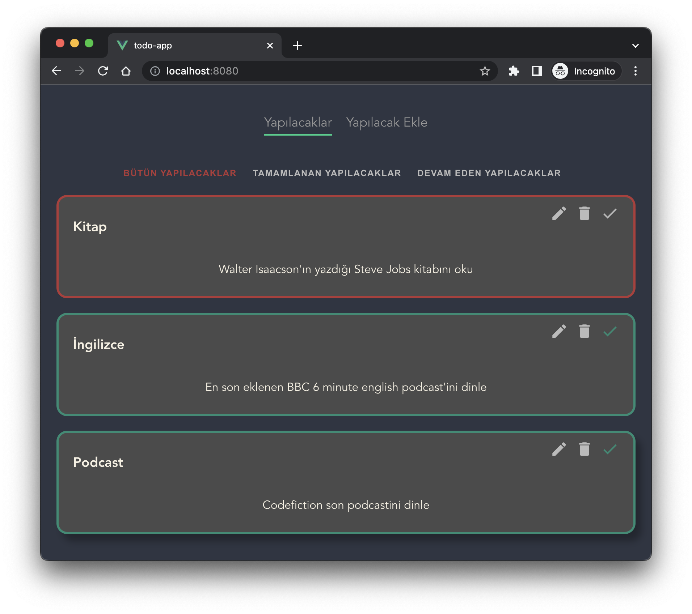
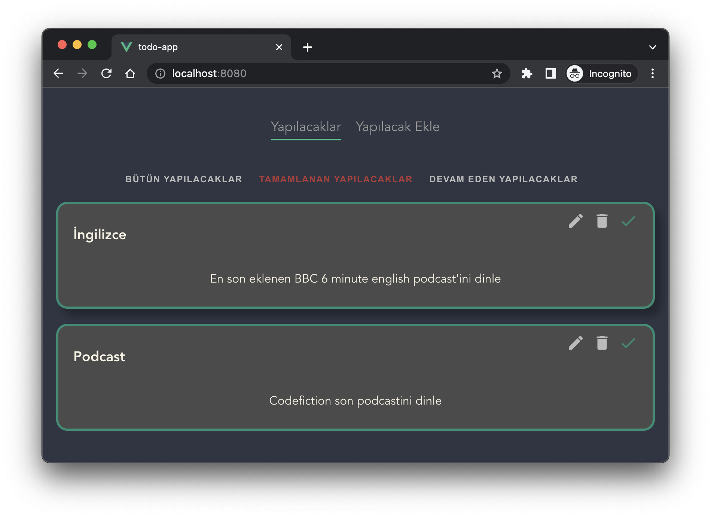
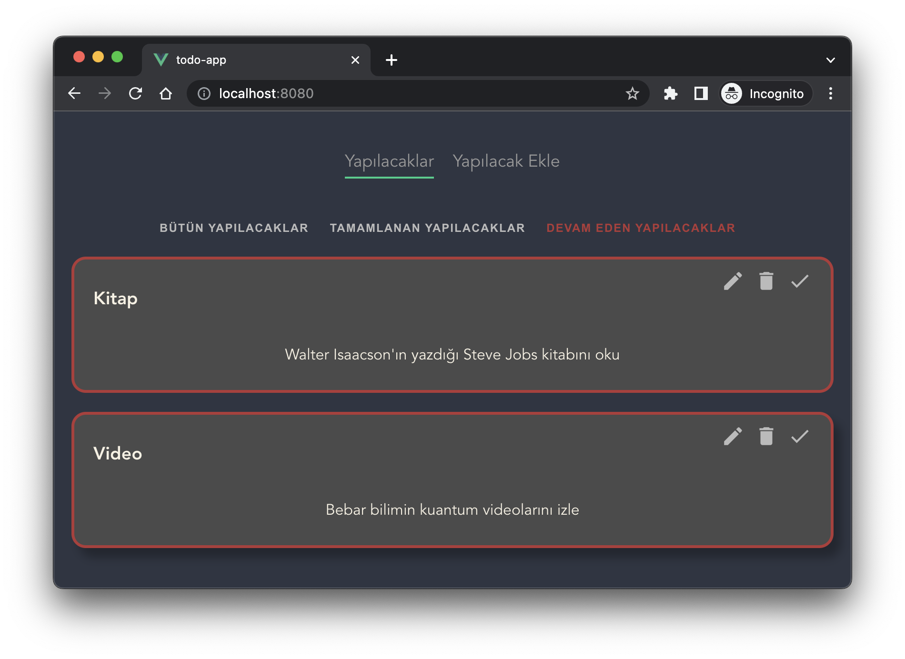
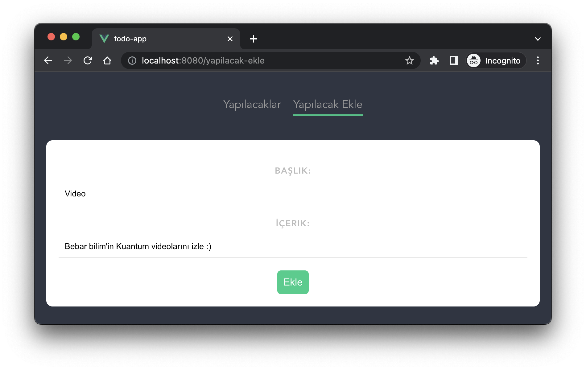

# To-do App

This is a to-do project to learn *vue*. *Json-Server* is used for backend.

I've had hands-on experience with ***router***, ***computed***, ***mounted*** and some other ***vue3*** topics.

## Project setup
---
Install dependencies:
```
npm install
```
Install [json-server](https://github.com/typicode/json-server):
```
npm install -g json-server
```


### Compiles and hot-reloads for development
---
First start the JSON Server
```
json-server --watch data/db.json
```
Start Application
```
npm run serve
```


## Screenshots

Main page



Page where the done is filtered



Page where the wait is filtered



Add page



